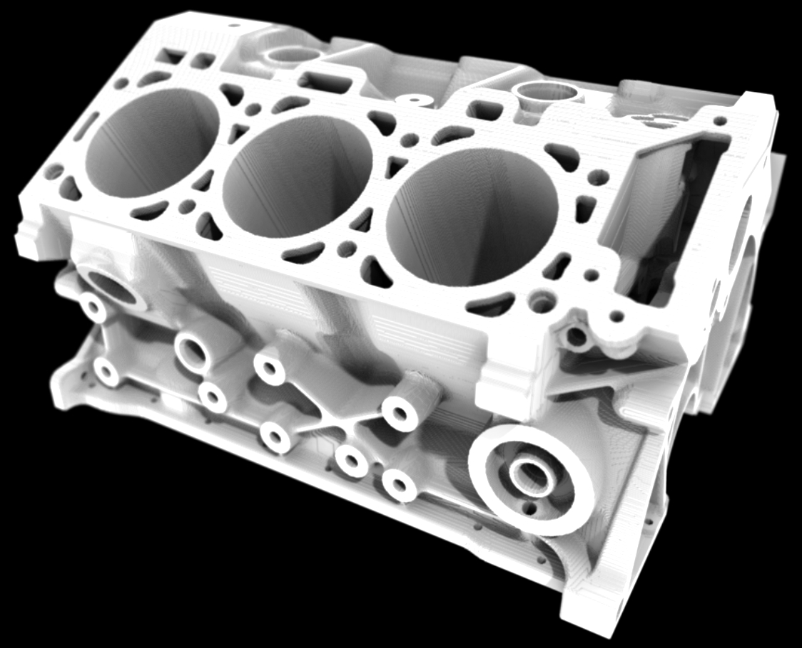

# VoxSurf
A simple, easily hackable C++ surface voxelizer (STL=>voxels)

Takes as input a file 'model.stl' from the source directory.
Outputs a voxel file names 'out.vox' that can be read by 'MagicaVoxel' https://ephtracy.github.io/

The basic principle is to rasterize triangles using three 2D axis aligned grids, using integer arithmetic (fixed floating point) for robust triangle interior checks.

Very simple and quite efficient despite a straightforward implementation. Higher resolutions could easily be reached by not storing the 
voxels as a 3D array of booleans (e.g. use blocking or an octree).

Here is a relatively large model voxelized at 1024^3 in ~1.5 seconds on a Core i5-3570, 3.4GHz. (Model: [Ford engine block by Ford](https://www.thingiverse.com/thing:40257), rendered in MagicaVoxel viewer).

The included STL model is [3D knot by chylld](https://www.thingiverse.com/thing:5506/#files)
